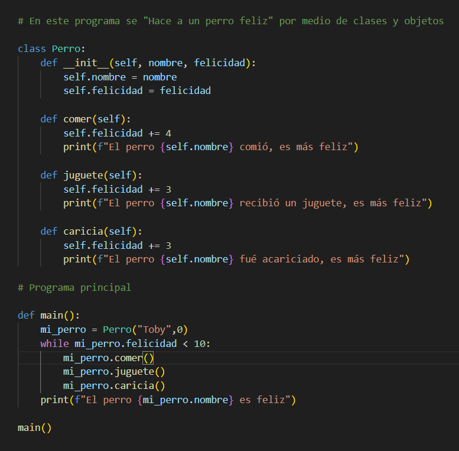

#  Hacer al Perro Feliz

Este proyecto es un ejemplo sencillo de **Programación Orientada a Objetos** en Python.  
El objetivo es crear un perro que pueda ser alimentado, recibir juguetes y caricias hasta alcanzar la felicidad.

---

## Descripción
- Se define una **clase `Perro`** que tiene:
  - Un **atributo `nombre`** (para identificar al perro).
  - Un **atributo `felicidad`** (que mide cuán feliz está el perro).
- La clase tiene tres **métodos**:
  - `comer()`  aumenta la felicidad en +4.
  - `juguete()`  aumenta la felicidad en +3.
  - `caricia()`  aumenta la felicidad en +3.
- En el programa principal:
  - Se crea un perro llamado `"Toby"`, con felicidad inicial `0`.
  - Mientras el perro no llegue a `10` de felicidad, se le dan las tres acciones (comer, juguete y caricia).
  - Al llegar a `10` o más, el programa muestra en pantalla que el perro es feliz.

---
