# *EJERCICIOS DE NIVELACION DE PROGRAMACION EN LENGUAJE PYTHON*

Con el objetivo de que todos los integrantes del grupo manejen un nivel mínimo de programación en Python se propucieron los siguientes ejerciciós básicos que tratan desde impresiones sencillas hasta iteraciones, para las que decidí utilizar el ciclo **For**.

## Imprimir por pantalla:

En los ejercicios 1 al 3 opté por solicitar la impresión directa de la variable solicitada , declarando el tipo de variable con **""**,**int** y **float** respectivamente. Haciendo esto en lugar de guardar las variables en un espacio de memoria

### Ejercicio 1:
Escribir un programa en Python que imprima por pantalla la frase “Hola, ya se imprimir frases”.
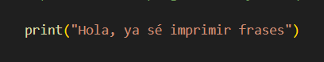

### Ejercicio 2:
Escribir un programa en Python que imprima por pantalla un número entero, por ejemplo el 273, o el 597.
*Para este caso decidí utilizar el primer ejemplo e imprimir el número 273* 
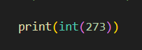

### Ejercicio 3:
Escribir un programa en Python que imprima por pantalla un número decimal, por ejemplo el 5.3, ó el 7.5.
*Para este caso decidí utilizar el primer ejemplo e imprimir el número 5.3* 
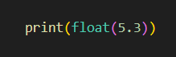

## Operaciones básicas y bucles:

Al igual que en los tre primeros ejercicios en lugar de guardar las operaciones en un espacio de memoria, decidí solicitar la impresión directa de las operaciones en los ejercicios 4 al 7.

### Ejercicio 4:
Escribir un programa en Python que imprima por pantalla la suma de 1234 y 532.
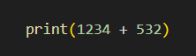

### Ejercicio 5:
Escribir un programa en Python que imprima por pantalla la resta de 1234 y 532.
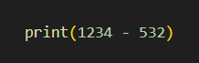

### Ejercicio 6:
Escribir un programa en Python que imprima por pantalla la multiplicación de 1234 y 532.
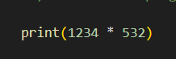

### Ejercicio 7:
Escribir un programa en Python que imprima por pantalla la división de 1234 entre 532.
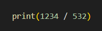

### Ejercicio 8:
Escribir un programa en Python que imprima por pantalla los números del 1 al 3.
*A partir de este punto decidí utilizar el ciclo **For** para todos los ejercicios dado que a mi parecer es no sólo una buena forma de reforzar mi dominio de este sino que era la mas que sufuciente para solucionar las necesidades de los ejercicios*
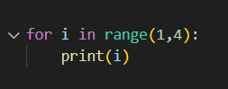

### Ejercicio 9:
Escribir un programa en Python que imprima por pantalla los números del 1 al 9.
*En el ciclo **For** utilicé el rango desde el inicio hasta **n+1**, siendo **n** el nimero final.*
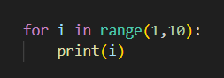

### Ejercicio 10:
Escribir un programa en Python que imprima por pantalla los números del 1 al 10.000. Conveniente usar bucles.
*Aunque decidí imprimir los numeros por separado se puede imprimir una lista mediante el constructor **list(range(a,n+1))** dónde a es el inicio del intervalo y n el final*
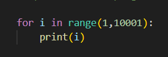

### Ejercicio 11:
Escribir un programa en Python que imprima por pantalla los números del 5 al 10.

### Ejercicio 12:
Escribir un programa en Python que imprima por pantalla los números del 5 al 15.

### Ejercicio 13:
Escribir un programa en Python que imprima por pantalla los números del 5 al 15.000. Conveniente usar bucles.
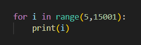

### Ejercicio 14:
Escribir un programa en Python que imprima 200 veces la palabra “hola”. Nota: en el código fuente que usted escriba debe figurar solamente una vez la palabra “hola”.
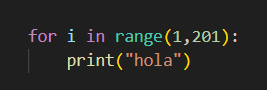

### Ejercicio 15:
Escribir un programa en Python que imprima por pantalla los cuadrados de los 30 primeros números naturales.
*No es necesario aplicar un formato la impresión para cumplir el requerimiento del ejercicio, sin embargo quice usarlo para favorecer la estetica en esta ocasión*
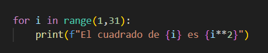

### Ejercicio 16:
Escribir un programa en Python que multiplique los 20 primeros número naturales (1*2*3*4*5...).
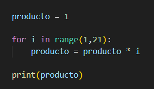

### Ejercicio 17:
Escribir un programa en Python que sume los cuadrados de los cien primeros números naturales, mostrando el resultado en pantalla.
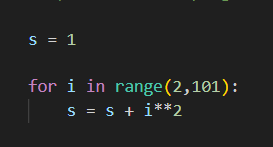

***Nota:** Este repositorio se irá actualizando conforme vaya realizando los demás ejercicios propuestos en clase*