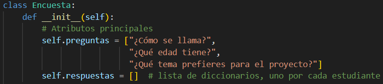

# Proyecto: Encuesta en Python (POO)

## Descripción
Este proyecto implementa un programa de encuesta en **Python** aplicando los conceptos básicos de la **Programación Orientada a Objetos (POO)**.  

El objetivo es recolectar información de 10 estudiantes mediante preguntas predefinidas y mostrar los resultados de manera organizada en consola.

---

## Objetivos del proyecto
- Practicar el uso de **clases y objetos** en Python.  
- Implementar **atributos** y **métodos** en una clase.  
- Utilizar **listas y diccionarios** para almacenar información.  
- Trabajar con **entradas de usuario** (`input()`) y salidas en consola (`print()`).  

---

## Funcionalidad
El programa realiza 3 preguntas a cada estudiante:
1. ¿Cómo se llama?  
2. ¿Qué edad tiene?  
3. ¿Qué tema prefieres para el proyecto?  

Luego de recolectar 10 respuestas, el programa muestra todos los resultados en formato organizado.

---

## Estructura del código
- **Clase `Encuesta`**
  - `preguntas`: lista de preguntas predefinidas.  
  - `respuestas`: lista de diccionarios, cada diccionario guarda las respuestas de un estudiante. 
        
  - `agregar_respuesta()`: solicita las respuestas de un estudiante y las guarda.  
        
  - `mostrar_resultados()`: imprime los resultados de los 10 estudiantes.
          

- **Función principal `main()`**
  - Crea un objeto de tipo `Encuesta`.  
  - Llama 10 veces a `agregar_respuesta()` para recolectar datos.  
  - Finalmente ejecuta `mostrar_resultados()` para mostrar todas las respuestas.  

- **Ejecucion**
    se repiten las tres preguntas solicitando informacion a los 10 estudiantes
            

    y al final se entrega la informacion organizada
            
            